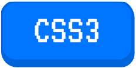
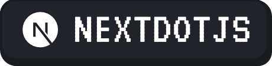

# ── .✦ Retro Badges Collection 💾

**Uma coleção de badges para dar aquele visual nostálgico e profissional ao seu perfil.**
 

[English](/README-en-US.md) | **Português**

---

## 📂 Categorias

Clique em uma categoria para ir direto para as badges:

* [💻 Languages](#-Languages)
* [⚙️ Frameworks & Bibliotecas](#%EF%B8%8F-frameworks--bibliotecas)
* [🌐 Social](#-social)
* [🛠️ Tools & Softwares](#%EF%B8%8F-tools--softwares)
* [🖥️ Sistemas Operacionais](#%EF%B8%8F-sistemas-operacionais)
* [🎨 Exemplos/Templates](/examples)

---

## 💻 Languages
[Voltar ao topo](#-categorias)

| Nome | Badge | HTML (Copiar e Colar) |
| :--- | :---: | :--- |
| **CSS 3** |  | `` |
| **HTML 5** |  | `` |
| **JavaScript** |  | `` |
| **TypeScript** |  | `` |
| **Python** |  | `` |
| **PHP** |  | `` |
| **Java** |  | `` |
| **C#** |  | `` |
| **C++** |  | `` |
| **C** |  | `` |
| **Swift** |  | `` |

 

## ⚙️ Frameworks & bibliotecas
[Voltar ao topo](#-categorias)

| Nome | Badge | HTML (Copiar e Colar) |
| :--- | :---: | :--- |
| **Ant Design** |  | `` |
| **Bootstrap** |  | `` |
| **Next.js** |  | `` |
| **React** |  | `` |
| **Tailwind CSS** |  | `` |

 

## 🌐 Social
[Voltar ao topo](#-categorias)

| Nome | Badge | HTML (Copiar e Colar) |
| :--- | :---: | :--- |
| **Instagram** |  | `<a target="_blank" href="https://www.instagram.com/SEU-NOME-AQUI/">` |
| **Twitter** |  | `<a target="_blank" href="https://x.com/SEU-NOME-AQUI">` |
| **Gmail** |  | `` |
 

## 🛠️ Tools & Softwares
[Voltar ao topo](#-categorias)

| Nome | Badge | HTML (Copiar e Colar) |
| :--- | :---: | :--- |
| **Git** |  | `` |
| **VS Code** |  | `` |
| **Blender** |  | `` |
| **Figma** |  | `` |
| **Photoshop** |  | `` |
| **Affinity** |  | `` |
 *Em breve...*

  

 ## 🖥️ Sistemas Operacionais
[Voltar ao topo](#-categorias)

| Nome | Badge | HTML (Copiar e Colar) |
| :--- | :---: | :--- |
| **Windows** |  | `` |
| **Linux** |  | `` |
| **macOS** |  | `` |

---

## 🤝 Contribuindo

Quer adicionar uma nova badge?
1. Faça um Fork deste projeto.
2. Adicione sua imagem na pasta `assets`.
3. Abra um Pull Request.

     
    Feito com 💜.

